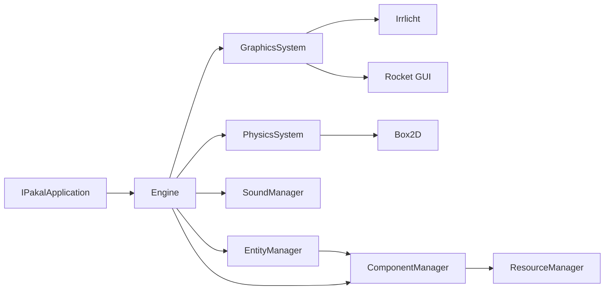

# Arquitectura de Pakal Engine

Resumen

Pakal es un motor modular escrito en C++ organizado en subsistemas (Systems) que implementan lifecycle hooks (initialize, update, terminate) y se registran en la clase central `Engine`. El motor sigue un patrón de entidad-componente (Entity/Component), y permite intercambiar implementaciones de subsistemas (por ejemplo, diferentes GraphicsSystem o PhysicsSystem) mediante allocators configurables en `Engine::Settings`.

Diagrama de alto nivel

Flujo de ejecución

1. Configuración: crear `Engine::Settings`, elegir allocators (graphics, physics, sound), y opciones (threads, max_fps).
2. Inicialización: `Engine` inicializa managers (ResourceManager, InputManager), crea subsistemas y llama a `initialize()` (cada System puede crear tareas asíncronas).
3. Loop principal: `Engine::run()` ejecuta el bucle, actualiza systems threadless y procesa eventos de ventana. Los `GraphicsSystem` y `PhysicsSystem` suelen correr dentro del bucle principal o en hilos, dependiendo de configuración.
4. Terminación: `Engine` llama a `terminate()` en cada sistema y managers para limpiar recursos.

Responsabilidades clave

- Engine: orquestación, ciclo de vida, registro de systems y managers.
- GraphicsSystem: render, UI, batchers, materiales.
- PhysicsSystem: simulación física, integración con componentes.
- ComponentManager / EntityManager: creación y administración de entidades y componentes.
- ResourceManager: carga y gestión de recursos (mallas, texturas, sonidos).

Referencias rápidas

- Engine: `source/Engine.h`, `source/Engine.cpp`
- Graphics (Irrlicht): `source/irrlicht/IrrGraphicsSystem.h`, `source/irrlicht/IrrGraphicsSystem.cpp`
- Physics (Box2D): `source/box2D/Box2DPhysicsSystem.h`
